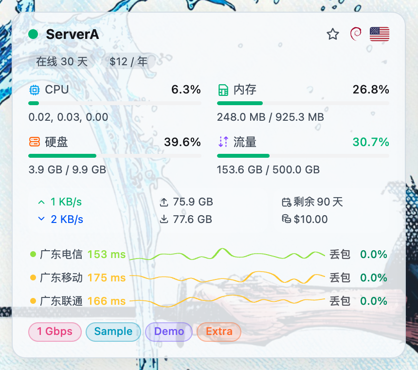
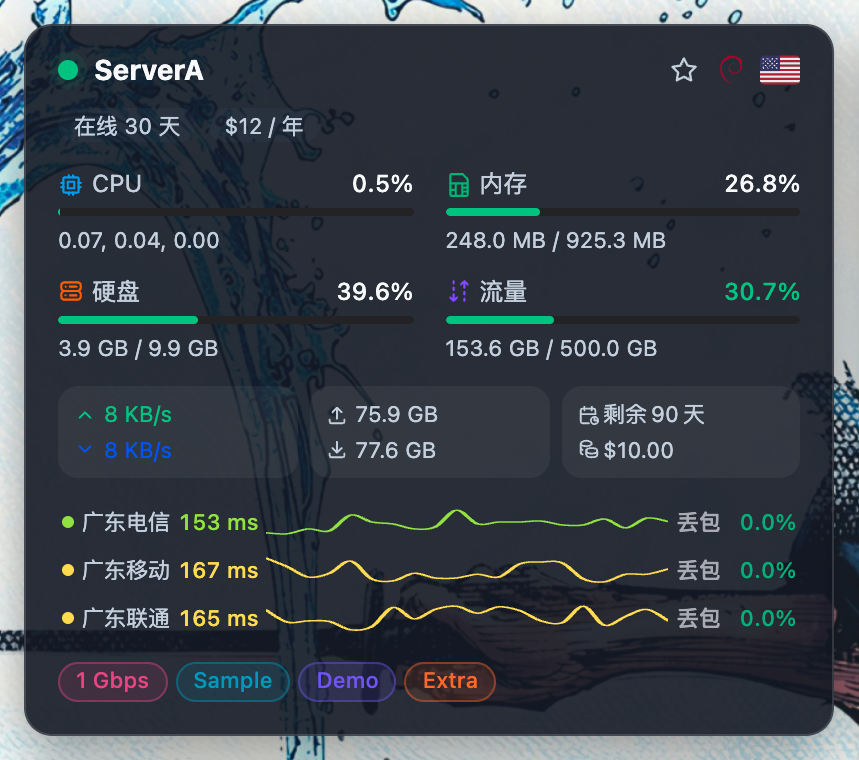

<div align="center">

# 🌌 Komari Glassmorphism

## 给自己用的 Komari 毛玻璃主题

fork 过来按自己的使用习惯改，需要什么补什么。


**[📥 下载 Release](https://github.com/towersip/komari-theme-Glassmorphism/releases)** ·
**[🚀 安装](#-安装--升级)** ·
**[✨ 功能](#-节点详情页全面升级)** ·
**[⚙️ 设置](#️-主题设置)** ·
**[🛠️ 开发](#️-本地开发)** ·
**[🌿 来源](#-项目来源)**

</div>

---

## 🌿 项目来源

从原项目 fork 过来给自己用的，按自己的需要改，不跟上游同步。

原项目：  
https://github.com/sanrokamlan-prog/komari-theme-Glassmorphism

本仓库：  
https://github.com/towersip/komari-theme-Glassmorphism

最早的毛玻璃基座是 [Tokinx](https://github.com/Tokinx) 的 [emerald](https://github.com/Tokinx/komari-theme-emerald)。

---

## 📸 预览

<div align="center">





</div>

---

## 🚀 项目定位

| 项目     | 说明                                                      |
| :------- | :-------------------------------------------------------- |
| 本仓库   | [towersip/komari-theme-Glassmorphism](https://github.com/towersip/komari-theme-Glassmorphism)，自己用，按需改 |
| 原项目   | [sanrokamlan-prog/komari-theme-Glassmorphism](https://github.com/sanrokamlan-prog/komari-theme-Glassmorphism) |
| 当前版本 | **v3.3.19**                                               |
| 主题定位 | Komari Monitor 可导入 zip 主题，不是普通 Web App 部署包   |
| 视觉风格 | 毛玻璃卡片、动态背景、浅色 / 深色 / 北京时间自动日夜模式  |
| 数据能力 | Metric Store 优先，旧接口自动 fallback，兼容 Komari 1.2.x |
| 高级工具 | 拓扑、性价比、健康摘要、快照导出、访客安全审计            |
| 发布产物 | `komari-theme-Glassmorphism-build-<short-sha>.zip`        |

> 按自己盯节点、Ping、流量、费用的习惯改，不是给所有人做的产品。

---

## 📶 v3.3.19 三网 Sparkline 每时段延迟

- 开启「三网新版样式」后，悬停或点按 Sparkline 可查看该时间段的时间和延迟，与旧版方柱提示一致
- 手机上点按折线会停留提示，点空白处关闭；该区域禁止选中复制

---

## 🖥️ v3.3.18 按服务器配置三网任务

- 管理员登录且开启「显示三网延迟」后，首页顶部会显示配置入口，可逐台服务器选择 1～3 个 Ping 任务
- 未单独配置的服务器继续使用全局三网任务；配置页直接勾选任务名称和 ID，不必手写 JSON
- 保存时按 Komari `pingtasks` 契约把全局任务写回 JSON 字符串，避免把已有三网任务清空
- 任务名含 IPv4/IPv6 时，卡片短标签会保留 `v4` / `v6`；Sparkline 行用 subgrid 对齐名称列

---

## 📴 v3.3.17 离线卡片与背景方向稳定

- 离线节点卡片改为顶栏「离线」徽章，内容降饱和显示，不再用毛玻璃遮罩盖住整张卡
- `auto` 背景方向只在进入或刷新页面时判断一次，同一页面内横竖屏切换不会重新加载背景

---

## 📐 v3.3.15 三网丢包对齐优化

- 三网新版样式收紧名称、延迟、折线和丢包之间的间距，避免窄卡片出现过大的空白
- 「丢包」文字固定到同一列，百分比保持右侧对齐，不会因 `0.0%`、`6.6%`、`31.1%` 宽度不同而错位
- 增加窄屏布局回归断言，确保三网标签和百分比持续对齐

---

## 📶 v3.3.14 三网新版样式可选

- 主题设置新增「三网新版样式」，默认关闭，节点卡片延迟/丢包继续用原来的双栏方柱
- 打开后改为名称 + 当前延迟 + Sparkline 折线 + 丢包率；未开三网时只影响卡片上的一组总览
- 本地 `bun run dev` 把 `/admin`、`/terminal`、`/assets` 代理到 Komari 1.5 内置管理端，方便改主题设置
- 主题包不再携带旧 `admin-app`
- 修复移动端滚动列表时背景图抖动、发糊（去掉 `background-attachment: fixed`）

---

## 🏪 v3.3.13 主题商店独立短名称

- 市场唯一短名称改为 `GlassmorphismTS`，可与已上架的 `Glassmorphism` 并存
- 显示名称为 Komari Glassmorphism TS；安装后主题目录按新 short 存放

---

## 📡 v3.3.12 节点卡片三网延迟与 iOS 缩放安全区

- 主题设置新增「显示三网延迟」开关，默认关闭
- 从延迟配置（Ping 任务）列表选择 1～3 个，不必凑满；例如只选广东电信，或电信/移动/联通三个都选
- 开启后卡片上原来的一组总览延迟/丢包会换成所选任务，选几个就显示几组，每组同样是延迟柱 + 丢包柱
- 任务名缩成「广东电信」这类短标签；历史柱复用首页已有 Ping 采样，不额外打请求
- 主屏幕模式下 Safari 网页缩放到 50%、75% 时按比例加大安全区，避免设置按钮缩进灵动岛下面点不到

---

## 📱 v3.3.11 iOS 主屏幕安全区修复

- 顶部控制栏适配 `safe-area-inset-top`，避免 iOS 主屏幕模式的状态栏、灵动岛遮住设置按钮
- 横屏时顶部内容避开左右安全区，底部访客信息条和返回顶部按钮避开 Home Indicator
- 页面最低高度使用动态视口单位，并为页脚补齐底部安全区
- 增加可模拟 iPhone 安全区尺寸的浏览器回归测试

---

## 🧹 v3.3.10 管理端空白与 404 修复

- 后台入口改为 Komari 1.5 的有效路由 `/admin/dashboard`，绕过裸 `/admin` 返回 404 的问题
- 增加无缓存的兼容 Service Worker，接管并替换旧 PWA Worker，清理 Workbox/Komari 旧缓存
- 兼容 Worker 仅把 `/admin`、`/admin/` 导向 `/admin/dashboard`，不缓存页面或静态资源
- 私有站点登录跳转同步使用 `/admin/dashboard`

---

## 🧭 v3.3.9 新版管理端路由修复

- 移除把 `/admin`、`/terminal`、`/manage/*` 跳转到主题内旧 `admin-app` 的入口桥接
- 安装包不再携带 7 月构建的旧管理端，后台和终端完全交由 Komari 1.5 内置前端处理
- 移除指向旧管理端的 PWA manifest，避免旧入口继续被浏览器或安装应用使用
- 后台按钮当时仍访问 `/admin`；Komari 1.5.0-fix1 的裸路径兼容问题已在 v3.3.10 修复

---

## 🎮 v3.3.8 Komari 1.5 GPU 兼容更新

- 兼容 Komari 1.5 实时状态中的嵌套 GPU `average_usage` 与逐设备数据
- 首页总览、节点卡片和详情页统一使用同一套 GPU 使用率归一化逻辑
- GPU 显存由已用字节与总量换算为百分比，不再把字节数误当百分比
- 保留旧版数值型 GPU 字段兼容，并纳入最新主分支的 GPU 修复

---

## 📈 v3.3.7 累计流量历史修复

- 修复节点详情历史图中累计上传、下载流量被按平均值降采样而偏低的问题
- `net.total.up` 与 `net.total.down` 现在按时间桶最后一个值展示，保留累计计数器语义
- 普通负载指标继续使用平均值聚合，不影响实时流量、流量配额、Agent 上报或后端记账
- 增加累计流量 RPC 聚合参数的浏览器回归检查

---

## 🗺️ v3.3.6 平铺地图总览卡片修复

- 修复 `tiled` 平铺地图模式强制使用固定卡片、忽略首页总览卡片方案的问题
- 平铺地图、球形地球和隐藏地球三种布局现在统一读取同一份卡片配置与顺序
- 增加平铺地图自定义卡片数量及顺序的浏览器回归检查
- 新增 Code Quality 工作流，PR 与 `main` 推送自动执行 lint 和 build

---

## 📡 v3.3.5 Ping 任务排序修复

- 详情页延迟任务卡片、图例和颜色顺序与后台 Ping 任务排序保持一致
- 详情负载面板中的 Ping 延迟与丢包指标线使用同一后台顺序
- 新指标统计接口返回乱序时，不再覆盖 `public:getPublicPingTasks` 的任务顺序
- 指标接口独有的未知任务按数值 ID 稳定追加，兼容后端升级过程中的短暂数据差异
- 增加后台顺序、统计顺序和 ID 顺序相互冲突的确定性回归检查

---

## ⏳ v3.3.4 到期预警与历史 CPU 修复

- 节点剩余时间在 5 天内标红、6–10 天标黄，超过 10 天保持默认色
- 无效到期日期不再误显示为“剩余 0 天”，统一降级为 `-`
- 修复 4 小时 / 1 天历史视图在新指标接口缺少 CPU 数据时显示空白的问题
- CPU 历史自动回退兼容接口，并过滤非有限数值，避免异常数据进入图表格式化
- 增加 5 / 10 天颜色边界与短时 CPU 回退的确定性浏览器回归检查

---

## 🆓 v3.3.3 免费节点文案修复

- `price = -1` 的免费节点只显示“免费”，不再拼接月付、年付等无意义周期
- 免费节点的单节点剩余价值统一显示“无 / N/A”，汇总金额仍按数字 0 安全计算
- 节点卡片、列表、对比面板、详情页和财务明细保持一致
- “排除免费节点”同时识别 `price = -1` 与 `白嫖中` 标签，不再漏算无标签免费节点

---

## 🎛️ v3.3.2 节点指标图标

- 节点卡片 CPU、内存、硬盘和流量标题增加原生线性图标，不再需要 custom body 注入脚本
- 图标语义与详情页保持一致，并继续保留指标文字和百分比，颜色不作为唯一识别方式
- mini 卡片以固定尺寸图标替代缩写 `C/M`，不增加卡片宽高并保留无障碍名称
- 增加桌面、移动端渲染断言和 mini 模式无障碍回归覆盖

---

## 🩹 v3.3.1 详情页负载与剩余价值修复

- 修复首页被 `KeepAlive` 缓存后，节点卡片仍在详情页维持全部节点 Ping 查询和定时刷新的问题
- 首页 Ping 摘要离开页面时立即释放订阅与在途请求，详情页只查询当前节点的指标
- 卡片摘要 `max_points` 从 6000 降为 150，完整 Ping 图表仍保留既有历史范围
- 修复提前续费或一次续多年时，剩余价值被错误封顶为单个计费周期价格的问题
- 新增详情页 RPC 请求范围回归断言，并用 10,000 组随机价格、周期和剩余天数校验两套价值计算入口

---

## 🚀 v3.3.0 大规模节点巡检与视觉回归

- 首页搜索扩展为节点名、地区、IPv4 / IPv6 与 CPU 型号模糊匹配，支持 `192.168.x.x` 等 IPv4 通配写法
- 新增收藏节点、收藏快捷筛选，以及详情页上一台 / 下一台 / 下拉切换
- 新增最多 4 台节点的实时横向对比，未选择时预览状态、CPU、内存、磁盘、网络、流量、运行时间和价格等对比字段
- 健康摘要新增综合异常排行，合并 CPU、内存、磁盘、流量、Ping、离线状态和磁盘增长风险
- 超过 30 台节点时首屏按视口延迟挂载卡片；空闲时错峰补齐，快速滚动时优先加载目标区域
- Metric `tags` 优先并继续兼容旧版 `tag`，保留 Komari 1.2.5 的 records / Ping fallback
- CPU 信息升级本地近似代际分级，并提供 CPU Mark 查询入口；未知或特殊型号可直接查看公开排行
- 优化手机端访客 IP 条和返回顶部按钮，滚动时自动避让，长 IPv6 不再撑宽页面
- 引入 7 场景 Playwright 视觉回归：桌面 / 手机、亮色 / 暗色、卡片 / 列表、色觉辅助、三种地球布局和节点详情

> 视觉测试使用完全虚构的固定节点、IP、价格与 Metric 数据，不访问真实主控，也不会进入主题 Release 压缩包。

---

## 🌍 v3.2.0 地球与地图显示修复

- 恢复 v3.1.8 的首页地球尺寸与头部高度，撤销 v3.1.9 引入的强制裁剪，真实地球不再消失或缩成小球
- 默认仍使用真实贴图地球；Cobe 点阵地球和平铺地图继续作为可选样式
- 修复平铺地图暗色样式错误作用于整个页面、导致页面透明度降到 20% 和整体发黑的问题
- 桌面与移动端均验证真实地球、Cobe 和平铺地图；移动端平铺地图使用内部横向滚动，不撑宽页面

---

## 🧩 v3.1.9 上游核心兼容与后台整合（历史）

- 内嵌管理端切回官方 `komari-web` `radix` 分支，不再依赖未合并的 Komari #604 / komari-web #82 计费字段
- 新增主题内“按量费用估算器”：按节点本地保存流量单价、手工小时、一次性附加费与计价币种，明确使用探针累计流量快照和 `1 TiB = 1024⁴ bytes`
- 当时曾内嵌旧版管理端处理 `/admin`、`/terminal`、`/manage/*`；该兼容桥接已在 v3.3.9 随 Komari 1.5 升级移除
- 后台毛玻璃样式加强，但将高成本模糊限制在导航、侧栏、表格和弹窗，避免密集节点页 GPU/CPU 开销放大
- 首页高级工具改为右上角按需显示；快捷控制移除月成本；管理员访客卡改为“尊敬的管理员”，窄屏仅保留底部 IP 条
- 支持持久背景路径 `local:文件名`，文件放在核心数据目录 `data/theme/user-assets/`，更新主题不会删除
- 修复首页地球与节点列表在中等桌面宽度下的视觉压盖，并将 Ping 空桶明确标记为“无采样数据”

> 按量费用估算器是纯前端辅助工具，不是账单系统。累计流量可能因重启或网卡变化重置，手工时长与附加费只参与本次估算。

---

## 🩹 v3.1.8 Swap 悬浮提示修复

- 修复节点卡内存区域的 Swap 悬浮提示被卡片裁剪成粗横条、遮挡卡片内容的问题
- 提示精简为 Swap 已用量与总量，不再显示占用率

---

## 🩹 v3.1.7 路由、费用与列表体验修复

- 修复首页点击节点进入详情时偶发只剩背景、必须刷新才能恢复的问题；路由视图重新保持单一元素根节点
- 修复列表模式流量栏悬浮时被行容器裁剪、出现粗细不一致残留条的问题
- 首页节点卡内存区域悬浮可查看 Swap 已用、总量与占用率
- 修复“完整”头部卡片方案仍只显示 6 张的问题；完整模式现在展示全部可用总览指标
- 实时费用的首次开机费只在后端确认真实 Agent 首次上报后计入，旧节点推定锚点不会提前收费
- 费率、计费锚点、累计流量与开机费状态可随节点元数据轮询实时刷新，无需整页刷新
- 内嵌管理端更新到 komari-web PR #82 最新提交，显示流量、运行时间、首次开机费与总估算明细
- 主题管理菜单缩短为“主题设置”，并重做可配置能力概念封面

---

## 🧩 v3.1.6 默认主题后台与费用明细

- `/admin`、`/terminal`、`/manage/*` 复用完整官方 komari-web，并增加 Glassmorphism 亮暗色覆盖与可重复同步脚本
- 首页节点延迟、丢包格可直接打开完整监测图；“剩余价值”可查看逐节点数据、切换显示币种并覆盖汇率
- 提前适配 [Komari PR #604](https://github.com/komari-monitor/komari/pull/604) 与 [komari-web PR #82](https://github.com/komari-monitor/komari-web/pull/82) 的流量单价、小时单价、首次开机费和首次 Agent 上报锚点；空费率按 0，旧核心不会收到未知字段
- 访客审计增加采集开关、UTF-8 安全截断，并继续支持当前筛选结果的完整 JSON / CSV 导出
- 默认背景改为原创青蓝、淡紫、薄荷网格图，与 `docs/preview.png` 的主题配色一致

> 实时费用字段需要升级到包含 Komari PR #604 的核心后才会出现；当前主题和嵌入管理端会通过返回字段自动检测能力。

---

## 🛡️ v3.1.5 色觉辅助与访客安全审计

主题设置新增“色觉辅助配色”。色觉友好模式使用蓝、蓝绿、橙、朱红和紫红安全色，并通过明度、图表虚实线、Ping 纹理、文字和图标共同区分状态，不再只依赖红绿颜色。

访客安全审计已提前适配 [Komari PR #602](https://github.com/komari-monitor/komari/pull/602)：

- 核心负责可信记录来源 IP、User-Agent、登录用户 UUID 和时间
- 主题记录页面、节点、分组、筛选、视图、工具和导出等受限操作摘要
- 首次页面事件附带站点隔离的会话 / 浏览器指纹，以及语言、时区、屏幕、硬件、自动化、WebGL 和 WebRTC 哈希摘要
- 审计面板支持服务端访客筛选、结构化查看，并全量导出当前筛选的 JSON / CSV
- 不上传密码、Cookie、Token、查询值、搜索词、WebSSH 命令、剪贴板、原始 ICE candidate 或原始局域网地址

> PR #602 已合并但尚未进入当前 Komari 正式版。升级到包含该 PR 的核心并开启 `visitor_audit_enabled` 后，主题会通过能力字段自动启用上报和访客筛选；旧核心不会收到未知 RPC 请求。

---

## 📶 v3.1.4 首页分时丢包修复

`v3.1.4` 修复首页节点卡的丢包时间格被整段平均值覆盖、导致所有格子同值同色的问题。

右侧汇总仍显示整个统计周期的平均丢包率；每个时间格改为读取 Metric Store 的 `ping.loss` 分时序列，并按各 Ping 任务的实际样本数加权。空桶继续显示为无数据，旧版 Komari 的 records 负值丢包逻辑仍作为 fallback 保留。

---

## 🧭 v3.1.3 路由过渡修复

`v3.1.3` 修复开启“减弱过渡动画”后，首页进入节点详情或返回首页时只剩背景、必须刷新才能恢复的问题。

减弱动画时，路由切换不再使用串行 `out-in` 离场流程，避免同步 `afterLeave` 与首页 `KeepAlive` 更新重入导致 Vue 丢失 DOM 锚点。关闭动画不会再影响页面正常渲染；未开启该选项时仍保留原有过渡效果。

---

## 🛟 v3.1.2 启动可靠性更新

`v3.1.2` 修复了一个会同时影响登录状态、节点详情和实时连接的启动单点故障。

旧流程中，首次 `rpc.ping()` 只要超时或遇到瞬时抖动，后面的公开设置、用户信息、节点数据和 WebSocket / 轮询就全部不会执行。现在这些请求已经拆开，单项失败不再拖垮整个应用。

```text
健康检查 ─┐
公开设置 ─┼─> 独立并行初始化 ─> 公共页面可用
用户信息 ─┤                     ├─> WebSocket / HTTP 轮询恢复
节点数据 ─┘                     └─> 全局错误提示与手动重试
```

| 修复项       | 当前行为                                                  |
| :----------- | :-------------------------------------------------------- |
| 健康检查     | 5 秒超时，最多 3 次递增间隔重试                           |
| 超时请求     | 通过 `AbortSignal` 主动取消，不残留悬挂请求               |
| 初始化       | `Promise.allSettled()` 隔离健康检查、设置、用户和节点请求 |
| 节点首拉失败 | 仍启动实时连接和轮询，网络恢复后自动补齐数据              |
| 错误提示     | 首页和 `/instance/:id` 等所有公开路由统一显示             |
| 手动恢复     | 全局提示提供重试按钮，并防止重复创建连接与定时器          |

> 这不是 Komari 1.2.5 / 1.2.6 的专属兼容补丁。新版后端响应变慢可能提高触发概率，但根因是前端启动链过度串行，现已从设计上修复。

---

## ✨ 节点详情页全面升级

主题已适配新版 Komari / komari-web Metric 能力，并将官方指标重新整理成适合监控场景的图表族。

| 分类        | 支持指标                                                       |
| :---------- | :------------------------------------------------------------- |
| 💻 CPU      | CPU、Load、Processes                                           |
| 🧠 内存     | RAM、RAM Total、Swap、Swap Total                               |
| 💾 存储     | Disk、Disk Total、磁盘耗尽预测                                 |
| 🚀 GPU      | GPU、GPU Device、GPU Memory、GPU Memory Total、GPU Temperature |
| 🌐 网络     | Download、Upload、周期流量、累计流量、TCP、UDP                 |
| 📡 网络质量 | Ping Latency、Packet Loss、多任务统计                          |
| 🌡️ 环境状态 | System Temperature、GPU Temperature                            |

> 不是简单堆叠 25 张单指标图，而是归并成 12 个稳定图表族，减少碎片化信息和无意义的重复展示。

### 📐 详情页布局

| 优化方向 | 当前能力                               |
| :------- | :------------------------------------- |
| 概览卡   | 18 类指标，7 套预设                    |
| 图表面板 | 12 个图表族，9 套预设                  |
| 响应式   | 移动端 2 列、中屏 3 列、宽屏 4 列      |
| 分区模式 | 可选概览 / 负载 / 延迟标签页           |
| 兼容配置 | 保留旧图表 key、旧卡位和 JSON 模板解析 |

---

## 🎨 详情页自定义能力

主题设置不要求修改源码。预设适合快速启用，英文 key 适合高级用户精确控制顺序和内容。

| 功能                | 状态 |
| :------------------ | :--- |
| 概览卡预设          | ✅   |
| 图表预设            | ✅   |
| 英文 key 自定义     | ✅   |
| 英文 / 中文逗号解析 | ✅   |
| 空格 / 分号解析     | ✅   |
| 多行粘贴解析        | ✅   |
| 后台 help key 说明  | ✅   |
| 旧配置兼容          | ✅   |

### 推荐配置方向

| 类型       | 适合场景                             |
| :--------- | :----------------------------------- |
| Resource   | CPU / 内存 / 磁盘资源监控            |
| Network    | 实时速率、累计流量、连接与 Ping 分析 |
| GPU        | GPU 利用率、设备、显存与温度         |
| Operations | 资源、连接、进程、温度与网络质量     |
| Full       | 覆盖完整官方 Metric 能力             |
| Custom     | 自己决定卡片和图表顺序               |

---

## 📈 Metric 接口升级

新版接口优先，旧版 Komari 后端继续保持兼容。

```text
新版 Metric API 有效
        ↓
public:queryMetrics / public:getPingMetricStats
        ↓
无数据或接口不可用
        ↓
common:getRecords / legacy records fallback
        ↓
保持图表与 Ping 正常展示
```

| 项目                        | 状态                |
| :-------------------------- | :------------------ |
| `public:queryMetrics`       | ✅ 优先使用         |
| `public:getPingMetricStats` | ✅ 优先使用         |
| `common:getRecords`         | ✅ 自动 fallback    |
| 自定义 `start` / `end`      | ✅                  |
| Metric `null` 断点          | ✅ 保留，不误判丢包 |
| 旧接口负值丢包哨兵          | ✅ 兼容             |

---

## 📶 Ping 模块增强

| 优化项目                 | 状态 |
| :----------------------- | :--- |
| Min / Max / Avg / Latest | ✅   |
| P50 / P99 / 波动率       | ✅   |
| 多任务丢包统计           | ✅   |
| 100% 丢包任务保留        | ✅   |
| Null 点不再误判丢包      | ✅   |
| 自定义起止时间           | ✅   |
| 新旧接口自动切换         | ✅   |
| 快速切换请求防旧数据覆盖 | ✅   |

适用于网络抖动分析、短时丢包排查和特定时间段异常定位。

---

## 🪟 首页驾驶舱

- 地球、点阵地球、平铺地图三种视觉模式
- 卡片 / 列表双视图，列表在密集节点下自动虚拟化
- `mini` / `compact` / `comfortable` / `large` 四档卡片密度，默认保持 `compact`
- 官方、基础、运维、资源、财务、流量、GPU、资产、完整和自定义总览方案
- 月成本、总流量、上下行、峰值、离线、高负载、即将到期等快捷控制
- 节点 `message` 在卡片 / 列表以纯文本提示，不使用 `v-html`
- 自定义图片 / 视频背景、毛玻璃配色预设、色觉辅助配色和动画减弱选项

---

## 🧰 首页高级工具

高级工具仅在登录验证通过后显示和执行。

| 工具          | 用途                                               |
| :------------ | :------------------------------------------------- |
| 🗺️ 拓扑分析   | 根据 ASN、厂商、分组和标签分析节点关系与异常集中点 |
| 💰 性价比排行 | 比较每核、每 GB 内存、流量额度和周期成本           |
| 🩺 健康摘要   | 聚合负载、磁盘、流量、离线状态和 Ping 风险         |
| 📤 快照导出   | 导出 JSON / CSV，内置 CSV 公式注入防护             |
| 📜 审计日志   | 管理员 / 访客记录、结构化安全信息、JSON / CSV 导出 |

---

## 🧱 底层架构

新功能遵循统一调用链：

```text
Component
    ↓
Composable
    ↓
Service
    ↓
RequestManager / CacheService
    ↓
API / RPC
```

同步具备：

- [x] 请求去重与并发限制
- [x] 超时、重试和 Abort 清理
- [x] TTL / LRU-like / 引用计数缓存
- [x] Metric Store 优先与旧接口 fallback
- [x] 共享 Ping / 负载历史数据流
- [x] 登录权限与敏感操作校验
- [x] Vue 响应式节点索引和实时更新

---

## 🔒 公开访问与安全边界

首页和节点详情页始终保持公开，不使用全局路由守卫阻断普通监控。

| 公开能力               | 登录后能力                   |
| :--------------------- | :--------------------------- |
| 普通节点状态与实时指标 | Hidden 节点                  |
| Load / Ping 历史图表   | 拓扑、性价比、健康摘要       |
| Ping 延迟与丢包统计    | 快照导出与审计日志           |
| 公开厂商元数据         | Geo 增强、磁盘预测等敏感路径 |

安全细节包括：

- 快照导出需要登录验证，可选二级密码
- CSV 中和 `=`、`+`、`-`、`@`、`|` 等公式注入前缀
- Markdown 链接和图片限制 URL scheme，拦截 `javascript:`
- 未登录可隐藏价格、费用卡片和后台入口
- 登录过期时降级到公共展示，不让整个 dashboard 崩溃

---

## 📱 WebKit / iOS 兼容

| 环境                       | 策略                                         |
| :------------------------- | :------------------------------------------- |
| Safari 15.4+               | 构建语法目标与基础可用边界                   |
| Safari 16.4+               | Tailwind CSS v4 完整视觉基线                 |
| 缺少 `oklch` / `color-mix` | 使用 sRGB token 和可读降级样式               |
| 旧 WebKit                  | 关闭高成本毛玻璃，避免透明或不可读界面       |
| Firefox                    | 对密集卡片和控制层关闭多层 `backdrop-filter` |

> 兼容策略的目标是保证基础功能和文字可读，不承诺老旧内核拥有与现代浏览器完全一致的视觉效果。

---

## ⚙️ 主题设置

全部设置由 [`komari-theme.json`](komari-theme.json) 托管到 Komari 后台，无需修改代码。

| 分类           | 代表设置                                            |
| :------------- | :-------------------------------------------------- |
| 基础与外观     | 主题模式、更新间隔、RPC 模式、默认视图、卡片尺寸    |
| 首页布局       | 公告、地球样式、访客信息、毛玻璃 / 色觉辅助配色     |
| 总览卡片       | 10 套方案、自定义 keys 和显示顺序                   |
| 高级工具与隐私 | 工具总开关、隐藏后台 / 价格、厂商别名、导出二级密码 |
| 快捷控制与列表 | 快捷按钮、列表元数据、离线置底、预警阈值、三网延迟、三网新版样式 |
| 详情概览       | 18 类指标卡、7 套方案、分区标签页                   |
| 详情图表       | 12 个图表族、9 套方案、GPU 图表和自定义 keys        |
| 自定义背景     | 亮 / 暗 URL、横屏 / 竖屏地址、图片 / 视频、模糊和遮罩 |

自定义背景支持按视口方向选择资源：`背景方向模式` 默认是 `auto`，每次进入或刷新页面时按当前视口选择一次，同一页面内横竖屏切换不会重新加载背景；也可以强制使用横屏或竖屏。亮色 / 暗色的横屏、竖屏地址留空时，会回退到对应的亮色 / 暗色背景地址，因此原有随机壁纸 API 无需改配置，静态壁纸则可分别填写四个方向地址。每个地址字段支持填写多张图片，用换行、英文逗号、中文顿号 `、`、竖线或分号分隔。

---

## 📦 安装 / 升级

### 方式一：使用 GitHub 仓库地址

Komari 后台支持直接填写仓库地址并拉取最新 Release：

```text
https://github.com/towersip/komari-theme-Glassmorphism
```

### 方式二：手动安装 Release

1. 打开 [Releases](https://github.com/towersip/komari-theme-Glassmorphism/releases)
2. 下载最新的 `komari-theme-Glassmorphism-build-*.zip`
3. 登录 Komari Monitor 后台，进入 **设置 → 主题管理**
4. 上传 zip 并启用主题
5. 在主题设置中调整视觉、卡片、快捷控制和高级工具

> 请上传 Release 附件中的主题 zip，不要上传 GitHub 自动生成的源码压缩包。

---

## 🛠️ 本地开发

环境要求：Node.js `^20.19.0` 或 `>=22.12.0`，Bun `>=1.2.0`。

```bash
bun install
bun run dev
bun run lint
bun run build
bun run test:visual
bun run preview
```

`bun run dev` 只跑主题首页。Komari 1.5 的管理端在监控服务自己那一侧，主题不再内嵌后台。

开发时把 API 指到你正在用的 Komari（默认 `http://127.0.0.1:25774`）：

```bash
# 本机 Komari
bun run dev

# 远程实例
VITE_API_TARGET=https://你的Komari域名 bun run dev
```

然后：

1. 打开主题预览：http://localhost:5173/
2. 点右上角齿轮「后台管理」，会进 `/admin/dashboard`（开发服已代理到 Komari 内置管理端）
3. 第一次：左侧 **设置 → 主题管理**，上传本仓库 `bun run build` 生成的 zip，启用短名称 **GlassmorphismTS**
4. 启用后侧栏会出现托管配置 **主题设置**，改完保存，回到 http://localhost:5173/ 刷新即可看到

也可以直接打开 Komari 自己的后台：`http://127.0.0.1:25774/admin/dashboard` 或 `https://你的域名/admin/dashboard`。裸 `/admin` 在部分 1.5 版本会 404，用 `/admin/dashboard`。

改 `src/` 会热更新；改后台主题设置要保存后再刷新首页。没启用 GlassmorphismTS 时，不会出现这套「主题设置」。

更新确认过的视觉基准图：

```bash
bun run test:visual:update
```

视觉测试需要先执行 `bunx playwright install chromium`。截图差异会输出到 `test-results/` 和 `playwright-report/`；GitHub Actions 失败时会自动上传差异附件。

构建成功后会生成：

- `dist/`
- `komari-theme-Glassmorphism-build-<short-sha>.zip`

发布包固定包含：

```text
komari-theme.json
preview.png
dist/
```

> 发布版本只改 [`komari-theme.json`](komari-theme.json) 顶层 `version`，不要给 `package.json` 添加顶层 `version`。

---

## 📝 更新日志

<details open>
<summary><strong>v3.3.19 · 三网 Sparkline 每时段延迟</strong></summary>

- 新版 Sparkline 支持按时间段查看延迟：桌面悬停、手机点按停留提示
- 三网折线区域禁止选中复制，避免误操作

</details>

<details>
<summary><strong>v3.3.18 · 按服务器配置三网任务</strong></summary>

- 管理员登录且开启「显示三网延迟」后，可按服务器勾选 1～3 个 Ping 任务
- 未单独配置的服务器继续使用全局三网任务；保存时按 Komari `pingtasks` 契约写回 JSON 字符串

</details>

<details>
<summary><strong>v3.3.17 · 离线卡片与背景方向稳定</strong></summary>

- 离线节点卡片改为顶栏「离线」徽章 + 内容降饱和，去掉整卡毛玻璃遮罩
- `auto` 背景方向只在进入或刷新时按当前视口选择一次，页面内旋转不再重新加载背景

</details>

<details>
<summary><strong>v3.3.16 · 自适应横竖屏背景与多图地址</strong></summary>

- 新增背景方向模式，可自动按视口选择横屏 / 竖屏，也可强制指定方向
- 亮色和暗色分别支持横屏、竖屏背景地址，留空时兼容回退到原背景地址
- 背景地址支持换行、英文逗号、中文顿号、竖线和分号分隔多张图片
- 进入或刷新页面时按当前视口选择背景；页面内横竖屏切换不重新加载

</details>

<details>
<summary><strong>v3.3.15 · 三网丢包对齐优化</strong></summary>

- 收紧三网新版行布局，减少名称、延迟、Sparkline 和丢包之间的无效间距
- 丢包标签使用固定列，百分比统一右对齐，适配不同位数的丢包数据
- 增加窄屏回归断言，防止标签再次发生横向错位

</details>

<details>
<summary><strong>v3.3.14 · 三网新版样式可选</strong></summary>

- 新增「三网新版样式」开关，默认关闭，保留原来的双栏方柱
- 开启后显示名称、当前延迟、历史 Sparkline 和丢包率
- 开发服代理 Komari 1.5 内置 `/admin`、`/terminal` 和 `/assets`
- 安装包不再包含旧 `admin-app`
- 修复移动端滚动时背景图抖动、发糊

</details>

<details>
<summary><strong>v3.3.13 · 主题商店独立短名称</strong></summary>

- 市场唯一短名称改为 `GlassmorphismTS`，避免与已上架的 `Glassmorphism` 冲突
- 显示名称为 Komari Glassmorphism TS

</details>

<details>
<summary><strong>v3.3.12 · 节点卡片三网延迟与 iOS 缩放安全区</strong></summary>

- 主题设置可开关三网延迟，并从延迟配置列表选择 1～3 个 Ping 任务，不必凑满 3 个
- 开启后原来的一组总览延迟/丢包换成所选任务，选几个就显示几组，每组同样显示延迟和丢包
- 标签如广东电信 / 广东移动 / 广东联通；历史柱复用首页已有 Ping 采样
- Safari 网页缩放到 50%、75% 时按比例放大 `safe-area-inset`，避免主屏幕模式下设置按钮缩进灵动岛下方点不到

</details>

<details>
<summary><strong>v3.3.11 · iOS 主屏幕安全区修复</strong></summary>

- 顶部控制栏适配 `safe-area-inset-top`，避免 iOS 主屏幕模式的状态栏、灵动岛遮住设置按钮
- 横屏时顶部内容避开左右安全区，底部访客信息条和返回顶部按钮避开 Home Indicator
- 页面最低高度使用动态视口单位，并为页脚补齐底部安全区

</details>

<details>
<summary><strong>v3.3.10 · 管理端空白与 404 修复</strong></summary>

- 后台与私有站点登录入口改为 `/admin/dashboard`
- 用无缓存兼容 Worker 替换旧 PWA Worker，并清理旧 Workbox/Komari 缓存
- 裸 `/admin` 导向官方内置后台的 `/admin/dashboard`
- 继续排除旧 `admin-app`，不重新内嵌过期管理端

</details>

<details>
<summary><strong>v3.3.9 · 新版管理端路由修复</strong></summary>

- 后台、终端和管理路由不再跳转主题内旧 `admin-app`
- Release 包不再包含旧管理端文件
- 移除旧管理端 PWA manifest 引用
- `/admin` 完全交由当前 Komari 内置管理端处理

</details>

<details>
<summary><strong>v3.3.8 · Komari 1.5 GPU 兼容更新</strong></summary>

- 兼容嵌套 `average_usage`、逐设备利用率与显存字段
- 首页、详情和历史图表统一 GPU 数据解析
- 修复 GPU 显存字节值被当作百分比显示的问题
- 保留旧版后端数值字段回退

</details>

<details>
<summary><strong>v3.3.6 · 平铺地图总览卡片修复</strong></summary>

- 平铺地图不再覆盖用户选择的首页总览卡片方案
- 自定义卡片 keys 的数量和顺序在全部地球布局中保持一致
- 增加平铺布局的聚焦浏览器回归断言
- GitHub Actions 自动执行 lint、未提交格式变化检查和 build

</details>

<details>
<summary><strong>v3.3.5 · Ping 任务排序修复</strong></summary>

- 延迟任务卡片、图例、颜色和指标线统一遵循后台公开任务顺序
- 修复新版 Ping 指标统计数组乱序导致前后台显示不一致的问题
- 未知任务使用稳定 ID 回退，不影响后台已知任务的位置
- 增加三套顺序相互冲突的聚焦回归覆盖

</details>

<details>
<summary><strong>v3.3.4 · 到期预警与历史 CPU 修复</strong></summary>

- 剩余 5 天内标红、6–10 天标黄，无效日期显示 `-`
- 4 小时 / 1 天历史缺少有效 CPU 点时自动回退兼容接口
- 过滤历史记录中的非有限数值，避免异常数据显示或格式化失败
- 增加到期颜色边界和短时 CPU 回退的浏览器回归覆盖

</details>

<details>
<summary><strong>v3.3.3 · 免费节点文案修复</strong></summary>

- 免费节点价格移除无意义计费周期，统一显示“免费”
- 单节点剩余价值改为“无 / N/A”，金额汇总继续使用数字 0
- 修正节点卡片、列表、对比、详情和财务明细之间的显示差异
- 排除免费节点时同时识别 `price = -1` 和 `白嫖中` 标签

</details>

<details>
<summary><strong>v3.3.2 · 节点指标图标</strong></summary>

- CPU、内存、硬盘和流量标题增加与详情页一致的原生线性图标
- mini 卡片用固定尺寸图标替代 `C/M`，保留无障碍名称和既有尺寸
- 增加桌面、移动和 mini 卡片的聚焦回归覆盖

</details>

<details>
<summary><strong>v3.3.1 · 详情页负载与剩余价值修复</strong></summary>

- 详情页停用首页全部节点的 Ping 摘要订阅，只保留当前节点指标请求
- 首页 Ping 摘要采样上限从 6000 降为 150，并在失去订阅时释放在途请求
- 提前续费覆盖多个周期时，按全部剩余天数累计剩余价值
- 增加 RPC 请求范围回归断言和 10,000 组随机数值校验

</details>

<details>
<summary><strong>v3.3.0 · 大规模节点巡检与视觉回归</strong></summary>

- 新增收藏、节点实时对比、详情快速切换和综合异常排行
- 搜索支持节点名、地区、IPv4 / IPv6、CPU 型号与 IPv4 通配
- 大量节点卡片采用首屏减载、空闲补齐、滚动优先的混合挂载策略
- Metric `tags` 优先，继续兼容 Komari 1.2.5 旧 records / Ping 接口
- 更新 CPU 代际近似分级和 CPU Mark 查询入口
- 增加 7 场景 Playwright 视觉回归与 GitHub Actions 差异附件

</details>

<details>
<summary><strong>v3.2.0 · 地球与地图显示修复</strong></summary>

- 恢复真实地球原尺寸与原头部布局，移除 v3.1.9 的强制高度和裁剪
- 修复平铺地图暗色 scoped CSS 泄漏导致整页发黑
- 验证真实地球、Cobe 和平铺地图的桌面/移动端尺寸、标记与溢出行为

</details>

<details>
<summary><strong>v3.1.9 · 上游核心兼容与后台整合</strong></summary>

- 与未合并的 #604/#82 解耦，按量费用改为主题本地估算器
- 官方管理端完整内嵌，修复子路径静态资源、主题管理 404 与样式缓存
- 加强后台玻璃质感并控制模糊成本，修复中等桌面地球/列表压盖
- 增加持久本地背景 `local:` 路径、管理员访客文案和高级工具显示开关

</details>

<details>
<summary><strong>v3.1.8 · Swap 悬浮提示修复</strong></summary>

- 内存区域悬浮提示改为浏览器原生提示，避免被节点卡裁剪或参与卡片布局
- Swap 信息精简为已用量与总量；总量缺失时仅显示已用量

</details>

<details>
<summary><strong>v3.1.7 · 路由、费用与列表体验修复</strong></summary>

- 修复首页进入节点详情时路由过渡留下空白页的问题
- 修复列表流量悬浮提示被裁剪成异常横条的问题
- 节点卡内存悬浮新增 Swap 使用明细
- “完整”首页总览方案改为展示全部可用卡片，不再等同于固定 6 张精选卡
- 首次开机费改为以后端真实上报状态为准，兼容旧节点推定锚点
- 新增计费字段的节点元数据就地刷新，管理员修改后无需整页重载
- 内嵌管理端同步到 komari-web `0fee1f1`，补齐实时费用明细与开机费语义
- 主题菜单改名为“主题设置”，更新主题可配置能力概念封面

</details>

<details>
<summary><strong>v3.1.6 · 默认主题后台与费用明细</strong></summary>

- 内置完整官方管理端与终端路由，增加 Glassmorphism 配色和可重复同步流程
- 延迟 / 丢包支持弹窗监测；剩余价值支持逐节点明细、显示币种与汇率覆盖
- 提前适配实时费用估算字段，并保持旧 Komari 核心账单表单兼容
- 访客审计增加采集开关、UTF-8 安全截断与完整 JSON / CSV 导出
- 使用与项目主预览同色系的原创默认背景

</details>

<details>
<summary><strong>v3.1.5 · 色觉辅助与访客安全审计</strong></summary>

- 新增标准 / 色觉友好主题选项、语义色、图表线型和 Ping 状态纹理
- 适配 `public:recordVisitorEvent`、`visitor_audit_enabled` 与访客日志筛选
- 增加站点隔离会话、浏览器 / WebGL / WebRTC 哈希等受限安全摘要
- 审计面板结构化显示 IP、UA、身份、会话和指纹，并支持完整 JSON / CSV 导出
- 旧核心保持兼容；敏感值、命令、剪贴板和原始网络候选不进入前端审计详情

</details>

<details>
<summary><strong>v3.1.4 · 首页分时丢包修复</strong></summary>

- 首页 Metric Store 查询同时读取 `ping.latency_ms` 与 `ping.loss`
- 每个丢包时间格按对应时间桶和 point `count` 加权计算，不再复用整段平均值
- `null` 空桶保持无数据，周期平均丢包文字继续使用精确汇总统计
- Metric 分时丢包数据不完整时自动回退旧 records 负值丢包逻辑

</details>

<details>
<summary><strong>v3.1.3 · 减弱动画路由切换修复</strong></summary>

- 修复开启“减弱过渡动画”后进入详情只剩背景的问题
- 修复异常发生后返回首页仍为空白、必须刷新恢复的问题
- 减弱动画时停用 `out-in` 串行离场，保留首页 `KeepAlive` 状态
- 正常动画配置继续使用原有页面淡入淡出效果

</details>

<details>
<summary><strong>v3.1.2 · 启动恢复与全局错误反馈</strong></summary>

- 修复健康检查偶发失败时跳过用户、节点和实时连接的问题
- 健康检查增加 5 秒超时、3 次递增间隔重试和请求取消
- 设置、用户、节点与健康检查改为独立并行初始化
- 节点首拉失败后仍启动轮询自愈；所有路由统一显示错误和重试入口

</details>

<details>
<summary><strong>v3.1.1 · 首页、列表与公开 Ping 修复</strong></summary>

- 修复默认背景被实色层遮挡和暗色模式全黑
- 修复列表 Ping 提示遮挡，并降低 DOM / hover 合成开销
- 普通 Ping 历史恢复公开访问，修复详情快速切换的旧请求覆盖
- 优化首页快捷控制计数和大样本时间合并

</details>

<details>
<summary><strong>v3.1.0 · 节点详情 Metric 驾驶舱</strong></summary>

- 对齐 Komari 1.2.6 的 25 个 Metric definition，归并为 12 个图表族
- 新增累计 / 周期流量、GPU 设备、显存、温度和 Ping 图表
- 增加详情概览 / 图表预设、自定义时间范围和多行 keys 配置
- 修复 Metric null、100% 丢包任务和多任务汇总问题

</details>

更多历史版本请查看 [Releases](https://github.com/towersip/komari-theme-Glassmorphism/releases)。

---

## ⭐ Support

主要给自己用。你也可以 star、fork，有问题可以提 Issue，不一定会按别人的需求改。

- ⭐ [本仓库](https://github.com/towersip/komari-theme-Glassmorphism)
- 🍴 需要自己改就 fork 走
- 💬 Issue 可以丢这边

通用版本请看 [原项目](https://github.com/sanrokamlan-prog/komari-theme-Glassmorphism)。

---

## ☕ Donation / Sponsor

如果你喜欢这个项目，也欢迎支持后续开发。每一份支持都会用于功能开发、Bug 修复、性能优化、文档和长期维护。

感谢 **可乐杯里泡枸杞**、**Leo Lin**、**HelloWorldx** 、**johnmill**的捐赠支持。

---

## 🙏 致谢

fork 自 [原项目](https://github.com/sanrokamlan-prog/komari-theme-Glassmorphism)，给自己用。毛玻璃基座是 [Tokinx](https://github.com/Tokinx) 的 [emerald](https://github.com/Tokinx/komari-theme-emerald)。也谢谢 [Komari](https://github.com/komari-monitor/komari)、[Komari Naive](https://github.com/tonyliuzj/komari-naive)、Vue、Vite、reka-ui、Tailwind CSS。

## 📄 License

[MIT](LICENSE)
